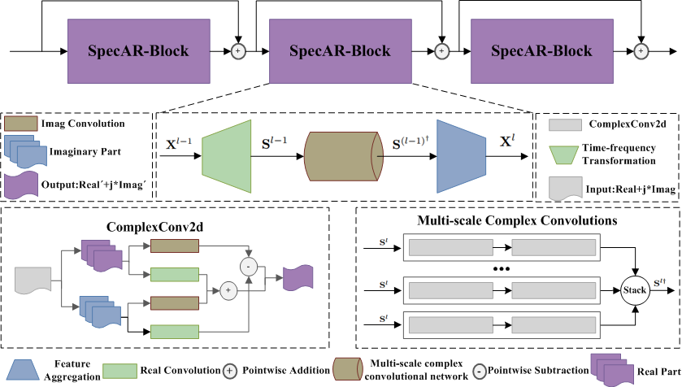
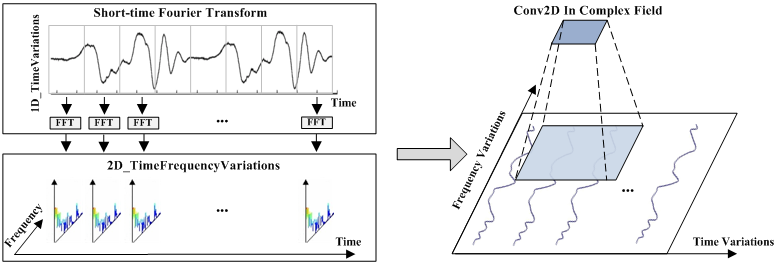
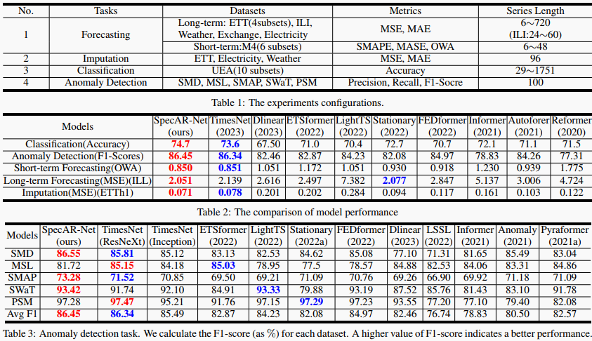
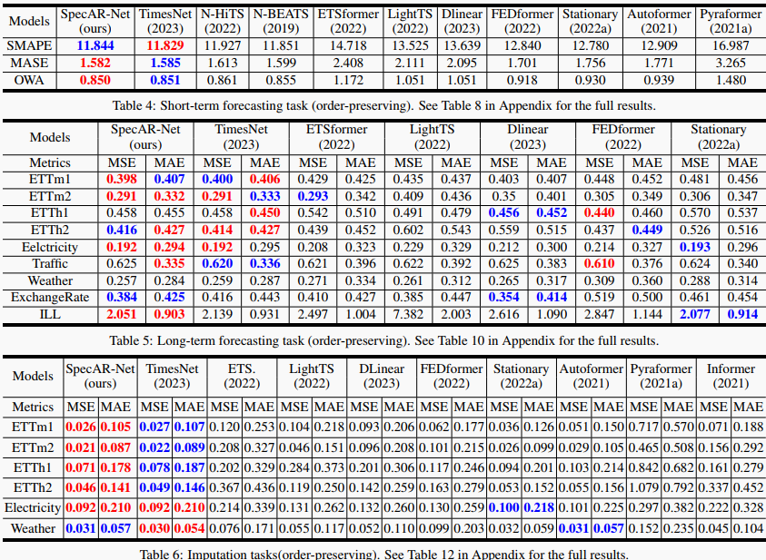

# SpecAR-Net
This repository contains the official implementation for the paper [SpecAR-Net: Spectrogram Analysis and Representation Network for Time Series](https:xxx) (IJCAI-24).

## Paper Info



- [SpecAR-Net: Spectrogram Analysis and Representation Network for Time Series], IJCAI 2024, accepted.

- Equal contributors:
  - [Yi Dong](https://github.com/Dongyi2go)
  - [Liwen Zhang](https://github.com/zlw9161)
  - [Youcheng Zhang](youcheng17@163.com)

This repository groups the implemetations of SpecAR-Net and Appendix of the paper.







## Requirements

The recommended requirements for SpecAR-Net are specified as follows:
* Python 3.8
* torch==1.13.1
* einops==0.6.0
* matplotlib==3.1.1
* numpy==1.21.6
* pandas==1.3.5
* patool==1.12
* reformer-pytorch==1.4.4
* scikit-learn==1.0.2
* scipy==1.7.3
* sktime==0.17.1
* sympy==1.10.1
* tensorboard==2.11.2
* tqdm==4.65.0

The dependencies can be installed by:
```bash
pip install -r requirements.txt
```

## Data
Prepare Data. You can obtain the well pre-processed datasets from
- [[Google Drive]] (https://drive.google.com/file/d/1nrXwdI4kyDUYKBj3ecRDZ2T-azh9i0JU/view?usp=sharing) or
- [[Baidu Drive]] (link: https://pan.baidu.com/s/1Q2BF1ZezEWPK2nmt5ZbUFg?pwd=uh25) 

Then place the downloaded data in the folder`./dataset`. Here is a summary of supported datasets.

<p align="center">

</p>

## Usage
1. Train and evaluate model. We provide the experiment scripts for all benchmarks under the folder `./scripts/`. You can reproduce the experiment results as the following examples:

```

# long-term forecast
bash ./scripts/long_term_forecast/ETT_script/SpecAR_Net_ETTh1.sh
# short-term forecast
bash ./scripts/short_term_forecast/SpecAR_Net_M4.sh
# imputation
bash ./scripts/imputation/ETT_script/SpecAR_Net_ETTh1.sh
# anomaly detection
bash ./scripts/anomaly_detection/PSM/SpecAR_Net.sh
# classification
bash ./scripts/classification/SpecAR_Net.sh
```

2. Develop your own model.

- Add the model file to the folder `./models`. You can follow the `./models/Transformer.py`.
- Include the newly added model in the `Exp_Basic.model_dict` of  `./exp/exp_basic.py`.
- Create the corresponding scripts under the folder `./scripts`.

## Citation

If you find this repo useful, please cite our paper.

```
@inproceedings{SpecAR2024,
  title={SpecAR_Net: Spectrogram Analysis and Representation Network for Time Series},
  author={Yi Dong and Liwen Zhang and Youcheng Zhang and Wen Chen and Shi Peng and Zhe Ma},
  booktitle={International Joint Conference on Artificial Intelligence},
  year={2024},
}
```

## Contact
If you have any questions or suggestions, feel free to contact:

- Yi dong (dongyi0552@126.com) 
- Liwen Zhang (lwzhang9161@126.com) 
- Youcheng Zhang (youcheng17@163.com)

Or describe it in Issues.


## Acknowledgement
We appreciate this github repos: https://github.com/thuml/TimesNet. 
